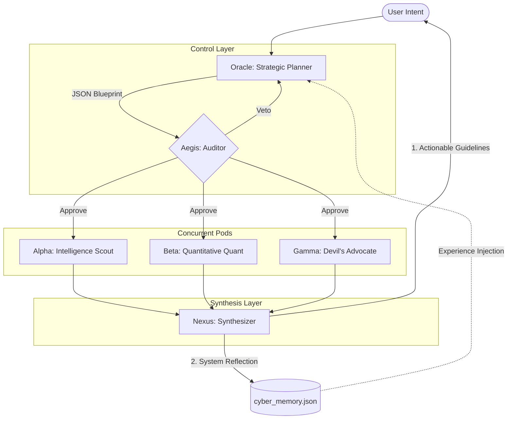

<div align="center">
  <h1>⛩️ Cyber-Stratagem</h1>
  <p><em>The Algorithmic Bureaucracy for Multi-Agent Orchestration</em></p>

  <p>
    <a href="README_zh.md">🇨🇳 简体中文</a> | <a href="README.md">🇺🇸 English</a>
  </p>

  <p>
    
    
    
  </p>
</div>

**Cyber-Stratagem** (Chinese: 赛博锦囊) is a minimalist, high-performance Multi-Agent orchestration engine inspired by the Tang Dynasty's "Three Departments and Six Ministries" bureaucracy and Stafford Beer's Viable System Model (VSM). 

It is designed to replace traditional chatbot interactions with an **algorithmic bureaucracy**. It dynamically decomposes complex user intents into parallel execution blueprints, routes them to specialized executor pods, and synthesizes the results into actionable strategic guidelines.

## 🌟 Core Features

- **Algorithmic Bureaucracy (Multi-Agent Routing)**: A strict, hierarchical architecture. The **Oracle (神谕核)** plans, the **Aegis (神盾核)** audits, the **Pods (执行簇)** execute in parallel, and the **Nexus (枢纽核)** synthesizes. 
- **Type-Safe State Machine**: Built entirely on strong TypeScript interfaces (`@sinclair/typebox`). Control flow is governed by deterministic JSON schemas rather than fragile prompt engineering.
- **Zero-Cost System Reflection**: Implements a self-evolving memory loop. The Nexus agent simultaneously summarizes reports and extracts optimal topological SOPs (System Reflection) in a single LLM pass, injecting historical heuristics into future Oracle prompts without adding latency or API costs.
- **Interactive TUI Dashboard**: Features a cinematic, dual-line streaming terminal UI. Real-time visualization of concurrent high-frequency LLM inference streams without terminal wrapping artifacts.
- **Provider Agnostic**: Built on the `@mariozechner/pi-ai` abstraction, allowing seamless switching between LLM providers (DeepSeek, Qwen, MiniMax, OpenAI) via simple environment variables.

## 🏗️ System Architecture



## 🚀 Getting Started

### Prerequisites
- Node.js >= 20.0.0
- npm or pnpm

### Installation

```bash
git clone https://github.com/Gabriel017yy/cyber-vsm.git
cd cyber-vsm
npm install
```

### Configuration
Create a `.env` file in the root directory:
```env
MINIMAX_CN_API_KEY=your_api_key_here
# Optional: TAVILY_API_KEY for search capabilities
```

### Usage
Run the CLI orchestrator:
```bash
npm start
```

## 🧠 Design Philosophy

1. **Occam's Razor**: "如无必要，勿增实体" (Do not multiply entities beyond necessity). No redundant agents, no unnecessary LLM loops. Features like System Reflection piggyback on existing LLM calls to achieve zero-cost evolution.
2. **Determinism over Magic**: LLMs are unpredictable. Cyber-Stratagem cages them using strict JSON schemas and validation loops. If an agent outputs malformed data, it is automatically corrected or soft-failed without crashing the system.
3. **Actionable Outputs**: Moves beyond binary "Approve/Reject" recommendations. Outputs actionable, multi-perspective strategic guidelines ("锦囊三策").

## 🗺️ Roadmap

- [x] **Phase 1**: Static Bureaucratic Hierarchy (Oracle -> Pods -> Nexus)
- [x] **Phase 2**: Safety & Auditing (Aegis integration)
- [x] **Phase 3**: Dynamic Tool Calling & Concurrent Actuators
- [x] **Phase 4**: Persistent System Reflection & Zero-Cost Memory Fusion
- [ ] **Phase 5**: Decoupling TUI and Engine (Preparation for Web/WeChat integrations)

## 🤝 Acknowledgements

This project is built upon the robust multi-agent orchestration framework [pi-mono](https://github.com/badlogic/pi-mono) created by Mario Zechner. The philosophical underpinnings draw heavily from cybernetics, specifically the Viable System Model (VSM).
