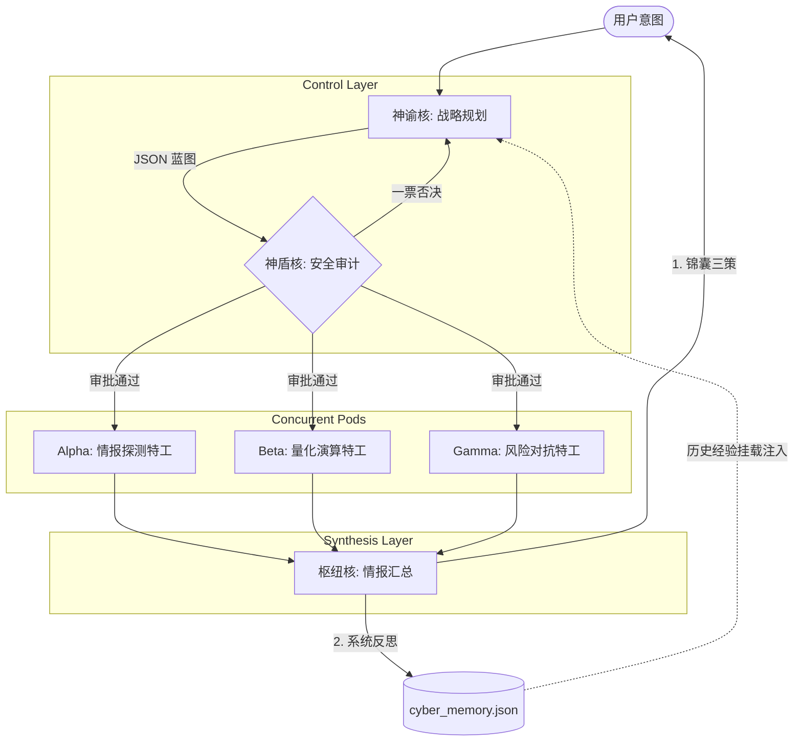

<div align="center">
  <h1>⛩️ 赛博锦囊 (Cyber-Stratagem)</h1>
  <p><em>极简主义的算法官僚体系，重塑 AI 协同决策</em></p>

  <p>
    <a href="README.md">🇺🇸 English</a> | <a href="README_zh.md">🇨🇳 简体中文</a>
  </p>

  <p>
    
    
    
  </p>
</div>

**赛博锦囊** (英文代号: Cyber-Stratagem) 是一个极简主义、高性能的多智能体（Multi-Agent）编排引擎。其架构灵感源自大唐的“三省六部制”以及 Stafford Beer 的控制论“可见系统模型（VSM）”。

它旨在用**算法官僚体系**取代传统的聊天机器人交互，能够动态地将复杂的用户意图拆解为并行的执行蓝图，路由给专门的底层特工节点（Pods），并将执行结果汇总为极具操作性的战略指导方针（即“锦囊三策”）。

## 🌟 核心特性

- **算法官僚体系 (多 Agent 路由)**：严格的科层制架构。**神谕核 (Oracle)** 负责统筹规划，**神盾核 (Aegis)** 负责安全审计，**执行簇 (Pods)** 并发执行具体任务，**枢纽核 (Nexus)** 负责汇总提炼。
- **类型安全的状态机 (Type-Safe State Machine)**：完全建立在强类型 TypeScript 接口 (`@sinclair/typebox`) 之上。系统控制流由确定的 JSON Schema 支配，而非脆弱的 Prompt 工程。
- **零消耗系统反思 (Zero-Cost System Reflection)**：内置自我进化的记忆回路。枢纽核 (Nexus) 在进行报告总结的同一次大模型生成中，会一并提炼出最优的神经元拓扑 SOP（系统反思）。这些历史经验将被自动注入到神谕核未来的上下文中，实现了在不增加任何延迟或 API 成本情况下的系统进化。
- **极具代入感的 TUI 控制台**：拥有电影级的双行流式终端交互界面。能够无撕裂地实时渲染并发的高频大模型推理脑电波。
- **底层模型解耦 (Provider Agnostic)**：基于 `@mariozechner/pi-ai` 抽象层构建，只需修改简单的环境变量，即可无缝切换各大模型服务商（如 DeepSeek, Qwen, MiniMax, OpenAI）。

## 🏗️ 系统架构图



## 🚀 快速开始

### 环境依赖
- Node.js >= 20.0.0
- npm 或 pnpm

### 本地安装

```bash
git clone https://github.com/Gabriel017yy/cyber-vsm.git
cd cyber-vsm
npm install
```

### 配置环境变量
在项目根目录创建一个 `.env` 文件：
```env
MINIMAX_CN_API_KEY=你的_api_key
# 可选: TAVILY_API_KEY 用于搜索引擎工具
```

### 运行系统
启动 CLI 调度引擎：
```bash
npm start
```

## 🧠 设计哲学

1. **奥卡姆剃刀 (Occam's Razor)**："如无必要，勿增实体"。拒绝堆砌无意义的 Agent 和冗余的 LLM 循环。例如：系统反思功能是通过搭乘现有 LLM 调用的“顺风车”来实现的，做到了零额外消耗的进化。
2. **确定性重于魔法 (Determinism over Magic)**：大模型的输出是不可控的。赛博锦囊通过极其严格的 JSON Schema 和校验重试回路将其“关进笼子”。如果 Agent 输出了错误格式，系统会自动纠偏或柔性降级，绝不会导致系统崩溃。
3. **行动导向 (Actionable Outputs)**：摈弃粗糙的“通过/驳回”二元建议。系统最终必须产出具备可执行性、多视角的战略指南（"锦囊三策"）。

## 🗺️ 演进路线图

- [x] **Phase 1**: 静态科层制架构确立 (Oracle -> Pods -> Nexus)
- [x] **Phase 2**: 安全与合规审计机制 (Aegis 整合)
- [x] **Phase 3**: 动态外部工具调用与神经元并发执行
- [x] **Phase 4**: 持久化系统反思与零消耗记忆融合
- [ ] **Phase 5**: 剥离终端 UI 与底层引擎 (为接入 Web/微信面板做准备)

## 🤝 致谢

本项目的底层多智能体调度框架基于 Mario Zechner 编写的 [pi-mono](https://github.com/badlogic/pi-mono)。项目的系统论哲学基础深受控制论中的可见系统模型 (VSM) 启发。
