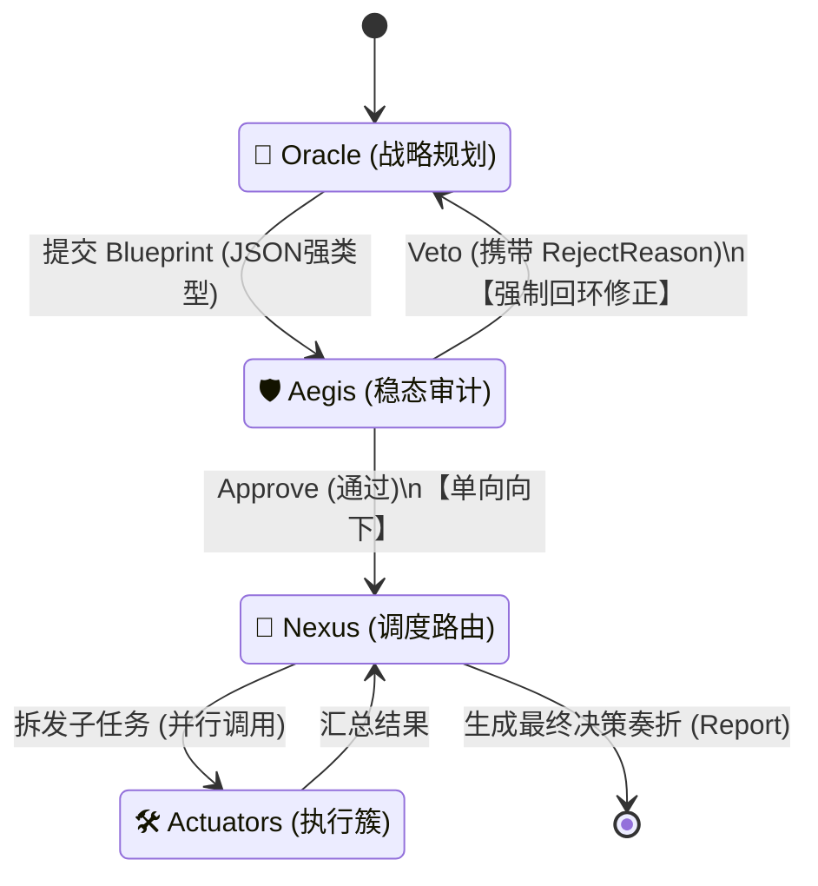

# 赛博国家决策机制：基于控制论的极简架构设计 (Cyber-VSM)

_最后更新：2026-04-28_

为了彻底摆脱传统政治隐喻的陈旧感与代码雷同争议，并高度契合“极简主义”的系统美学，本架构完全跳出人类官僚体制（如三省六部）。我们通过提取人类历史上**最高效、最冰冷的控制机制**，原创设计了一套适用于 AI 时代的 **“赛博控制论体制 (Cybernetic State Mechanism)”**。

---

## 1. 理论根基与历史原型

在构思赛博国家的体制前，我们只提取了历史上最精炼的“决策与风控”组件。详细历史渊源请查阅以下深度研究文档：

*   🔗 **[参考文档：Project Cybersyn 与 生存系统模型 (VSM)](./ref-cybersyn-vsm.md)**
    *   *核心提炼*：抛弃职能部门设定。系统由 5 个信息处理节点组成。决策依赖的是实时的信息流与反馈循环，而不是人的“协商”。
*   🔗 **[参考文档：罗马共和国保民官与绝对否决权 (Veto)](./ref-roman-tribune.md)**
    *   *核心提炼*：风控不应该参与“共创”。风控的唯一权力就是单向的“绝对阻断 (Veto)”，迫使规划者自行重做，从而实现代码流转上的极致防震荡。

---

## 2. 全新极简架构：Cyber-VSM Protocol

结合 `pi-mono` 的极简代码哲学，我们将 VSM (生存系统模型) 浓缩并映射为代码层面的 **“核心三核 (Tri-Core)”**：

### ⚙️ System 5: The Sovereign (主权核) —— The User
*   **角色**：系统的至高主宰。
*   **职责**：输入原始意图（Intent），在最后阶段审阅系统输出的“奏折/决策案”，一键批准或驳回。

### 🔮 System 4: The Oracle (神谕核) —— Planner Agent
*   **角色**：向外看的战略与推理中枢。
*   **机制**：只负责发散与建构。接收主权核的意图，调用最强的 LLM（如 GPT-4o），将其推演、拆解为详尽的「执行蓝图 (Blueprint)」。

### 🛡️ System 3: The Aegis (神盾核) —— Auditor Agent
*   **角色**：向内看的风控与稳态维持者。
*   **机制**：继承了**罗马保民官的绝对否决权 (Veto)**。它**不参与规划**，只对 Oracle 生成的蓝图进行逻辑、安全、资源的扫描。如果发现致命缺陷，直接 `Veto` 并返回 `RejectReason`。代码将强制流转回 Oracle 重组蓝图，实现绝对安全的系统闭环。

### 🔀 System 2: The Nexus (枢纽核) —— Dispatcher Agent
*   **角色**：消除系统震荡的协调路由器。
*   **机制**：当蓝图经 Aegis 验证无误后，Nexus 接管。它**不思考业务逻辑**，只负责调度并发、控制速率限制（Rate Limits）、以及将子任务分发给 System 1。

### 🛠️ System 1: The Actuators (执行簇 / The Pods)
*   **角色**：高度专业化的底层分析单元。
*   **机制**：类似于原设想中的“六部”，但专为**复杂决策支持**而生。Nexus 调度器并不直接干活，而是根据蓝图将子任务分发给以下并行的功能簇（Pods），这些 Agent 被封装为 Tool 调用：
    1.  **Pod Alpha (情报探测者 / The Scout)**：负责联网检索、背景数据采集、事实核查。类似古之“职方/礼部”，但这里只做 Data Gathering。
    2.  **Pod Beta (量化演算者 / The Quant)**：负责数据计算、成本收益对比分析、ROI 评估。类似“户部/工部”，提供冰冷的数据支撑。
    3.  **Pod Gamma (红蓝对抗者 / The Devil's Advocate)**：专门被设定为“悲观主义者”，它的唯一任务就是寻找计划的弱点、执行风险、最坏情况推演。类似“刑部/御史”。
    *Nexus 将并发调用这三个 Pod，将情报、量化和风险三方视角的答案汇总，最终呈递为主权核看到的“决策奏折”。*

---

## 3. 核心难点突破：Cyber-Router 路由与双向通信机制

通过源码分析，底层的 `pi-agent-core` 缺乏原生的多 Agent 聊天总线。为了避免落入类似 AutoGen 闲聊室的陷阱，我们原创设计了基于**进程内状态机 (State Machine)** 的强类型通信拓扑，这正是我们与其他开源方案的巨大分水岭。

详细的痛点分析与行业对比，请查阅：
*   🔗 **[技术难点剖析：多 Agent 路由与通信拓扑](./tech-gap-analysis.md)**

### 通信拓扑核心逻辑

我们利用 TypeScript 控制流而非 Slack Webhook，通过 `Orchestrator` 协调三个独立的 Agent 实例，形成闭环：

**通信准则**：
1.  **无闲聊原则**：Agent 之间不存在自然语言对话，仅通过结构化 JSON 数据（Blueprint / VetoReason）进行通信。
2.  **硬编码回环**：如果 Aegis 触发 Veto，并不是给 Aegis 增加一个调用 Oracle 的 Tool，而是由最外层的控制环截获信号，主动调用 `Oracle.continue(rejectReason)`，保证上下文隔离和单向控制的稳定性。

---

## 4. 实施阶段 (Implementation Plan)

通过以上理论背书与路由机制的解决，我们的架构在思辨性和技术可行性上都达到了极高的水准。下一步就是在代码库中将这三核系统落地。
**请参考主工作流跟踪：[PROJECT_LOG.md](../docs/PROJECT_LOG.md)**。
