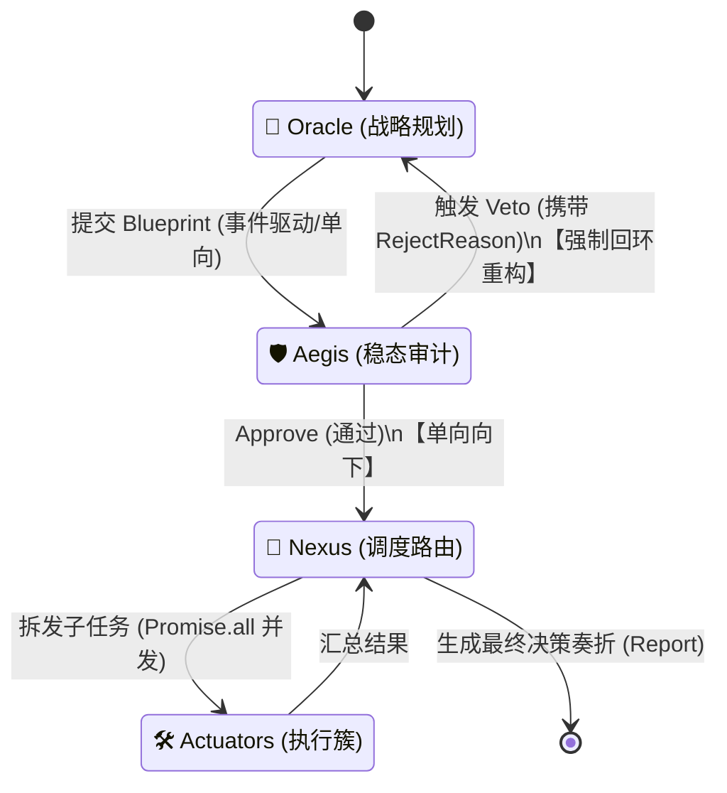

# 技术难点剖析：多 Agent 路由与通信拓扑 (Tech Gap Analysis)

_最后更新：2026-04-28_

在确立了 **Cyber-VSM (赛博控制论体制)** 后，我们需要面对最硬核的技术挑战：如何在一个没有原生多 Agent 聊天机制的框架（如 `pi-mono`）上，实现多个 Agent 之间的双向、多向路由沟通。

## 1. 行业现状：主流多 Agent 通信方案的优劣
通过对目前业界主流的多 Agent 框架（AutoGen, CrewAI, LangGraph）的调研，总结出以下三种主流通信模式：

1.  **Pub/Sub 聊天室模式 (以 AutoGen, danghuangshang 为代表)**
    *   *原理*：所有 Agent 共享一个群聊消息总线，通过 `@AgentName` 来互相唤醒。
    *   *缺点*：极度不可控，非常容易陷入发散式的“闲聊”或互相推诿；状态追踪困难（不知道现在流程到底走到哪一步了）。这**严重违背**了我们决策引擎“强一致性、高确定性”的要求。
2.  **层级 Tool 模式 (以 CrewAI, Claude Code 为代表)**
    *   *原理*：存在一个 Manager Agent，其他 Agent 作为 Tool（工具）挂载给它。Manager 通过调用 Tool 的形式启动 Sub-Agent。
    *   *缺点*：这种模式是**单向树状**的（Top-Down）。在我们的 Cyber-VSM 中，Aegis (神盾核) 具有“打回重做”的 Veto 权，如果 Aegis 只是一个 Tool，它很难实现跨层级的长生命周期驳回（即要求 Oracle 重新规划，而不是简单返回一个错误让 Manager 处理）。
3.  **状态机编排模式 (以 LangGraph 为代表)**
    *   *原理*：Agent 不直接“聊天”，而是共同操作一个全局的 `State` 对象。Agent 相当于图 (Graph) 中的节点 (Node)，节点之间通过严格定义的边 (Edge) 和条件逻辑 (Conditional Edges) 进行流转。
    *   *优点*：**完美的确定性**和**强类型的流转**。非常适合硬核的决策引擎。

## 2. 我们的底层框架：`pi-agent-core` 的局限性
经过源码分析（`pi-mono/packages/agent/src/agent.ts` 和 `agent-loop.ts`），我们发现：
*   `pi-agent-core` 提供的是极度优雅的**单 Agent 核心循环**（Prompt -> 思考 -> 工具调用 -> 回复）。
*   它支持队列注入（Steering / FollowUp messages），但**不存在原生的多 Agent 通信信道或 Router**。
*   它是一个纯粹的“大脑”，不包含“组织结构”。

**巨大难点结论**：我们不能指望框架自己帮我们完成 Oracle 和 Aegis 的沟通，必须自己实现一套**轻量级的 Agent 路由通信机制 (Agent Routing Protocol)**。

## 3. 解决方案：基于状态机同步流转的 Cyber-Router

为了契合极简哲学，我们既不需要引入庞大的 LangGraph，也不能依赖 Slack 的 webhook 机制，我们直接在 Node.js (TypeScript) 层面实现一个**进程内的有向图状态机**。

### 3.1 核心拓扑图 (Communication Topology)

我们将定义一个全局的 `DecisionState` 状态对象，由一个原生的 TypeScript 控制器 (`Orchestrator`) 来协调 3 个独立的 `pi-agent-core` 实例。

### 3.2 具体的交流通路 (The Communication Pathway)

在这个机制下，Agent 之间不存在模糊的自然语言“闲聊”，只存在**强类型的数据握手**：

1.  **The Handshake (Blueprint 移交)**
    *   `Oracle` 运行结束，输出的并不是一段人类可见的文本，而是一个严格符合 JSON Schema 的 `Blueprint` 对象。
    *   `Orchestrator` 截获这个对象，并将其作为 Prompt 喂给 `Aegis` 实例。
2.  **The Feedback Loop (Veto 双向路由)**
    *   `Aegis` 审查完毕，如果发现漏洞，它不会通过 ToolCall，而是直接输出特定的格式（如 `{"status": "VETO", "reason": "..."}`）。
    *   `Orchestrator` 解析到 VETO，就会调用 `Oracle.continue(rejectReason)`，将错误信息沿着时间线强行塞回 Oracle 的记忆上下文中，迫使其基于原计划进行修正。
3.  **The Fan-out (多路分发)**
    *   一旦 `Aegis` 输出 `{"status": "APPROVED"}`，`Orchestrator` 阻断前向循环，将 `Blueprint` 发送给 `Nexus`。
    *   `Nexus` 是一个特殊的调度 Agent，它的“工具”就是底层的 System 1 (Actuators)。它会并行调用这些工具，实现异步的任务下发。

## 4. 总结

`pi-mono` 是一颗极简纯粹的单核处理器，而我们要用它搭建一台多核服务器。这注定了我们不能用“让 Agent 在聊天室里自由对话”这种松散低效的手段。

我们设计的 **Cyber-Router 状态机拓扑**，利用 TypeScript 的异步控制流（Async/Await 和 Promise）来硬编码流转逻辑。这种**非聊天室、纯数据驱动的强类型通信机制**，正是市面上普通 Agent 框架和专业级 AI 决策引擎的分水岭。
